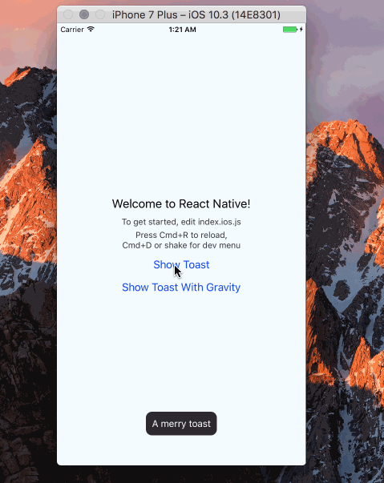

# @merryjs/toast
> Same as ToastAndroid, ios using https://github.com/scalessec/Toast


## Getting started

`$ npm install @merryjs/toast --save`

### Mostly automatic installation

`$ react-native link @merryjs/toast`

### Manual installation


#### iOS

1. In XCode, in the project navigator, right click `Libraries` ➜ `Add Files to [your project's name]`
2. Go to `node_modules` ➜ `@merryjs/toast` and add `MerryToast.xcodeproj`
3. In XCode, in the project navigator, select your project. Add `libMerryToast.a` to your project's `Build Phases` ➜ `Link Binary With Libraries`
4. Run your project (`Cmd+R`)<


## Usage

Please see http://facebook.github.io/react-native/docs/toastandroid.html

```javascript

import MerryToast from '@merryjs/toast';
MerryToast.show('A pikachu appeared nearby !', MerryToast.SHORT);
MerryToast.showWithGravity('All Your Base Are Belong To Us', MerryToast.SHORT, MerryToast.CENTER);

```
  